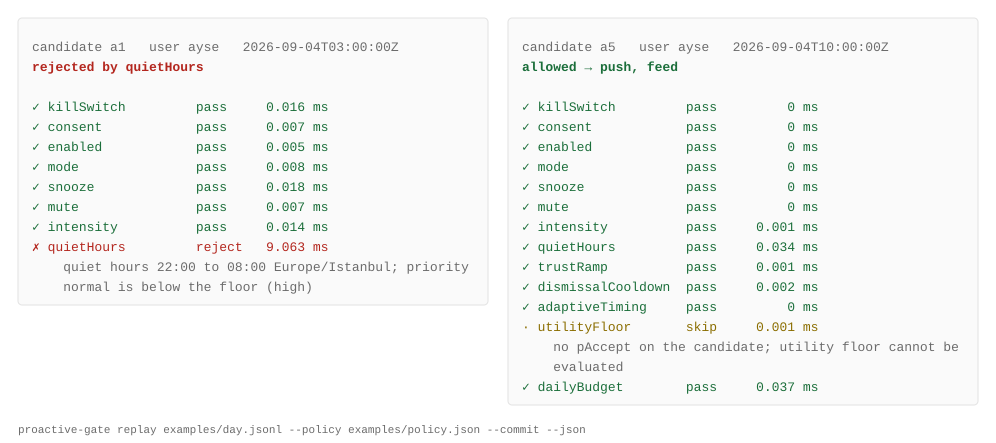

# proactive-gate

English | [Türkçe](README.tr.md)

<p>
  
  
  
  
  
  
</p>

Decide whether a proactive AI agent may reach a user right now, and log why not.

A proactive assistant has two halves. The generating half decides what is worth
saying. The suppressing half decides whether to say it now, later, or never. Almost
everything written about proactive AI is about the first half. This package is the
second half: one gate, an ordered list of checks, and a reason for every rejection.

```
npm install proactive-gate
```

```ts
import { createGate, defaultChecks, RedisStore } from "proactive-gate";

const gate = createGate({
  store: new RedisStore(redis),                  // MemoryStore() for one instance
  checks: defaultChecks({ dailyLimit: 3, quietHoursFloor: "high" }),
  onDecision: (d) => log.info("gate", d),        // every decision, allowed or not
});

const decision = await gate.evaluate({ user, candidate });
if (decision.allowed && (await gate.commit(decision, { user, candidate }))) {
  await send(decision.surfaces, candidate.payload);
}
```

Or start from a policy file and the wiring for your framework, in one command:

```
npx proactive-gate init --preset usTcpa --framework mastra
```

That writes `proactive-gate.policy.json` with the ten checks in order, appends the
preset you named, and prints the preset's own source next to the few lines that plug
the gate into that framework. `npx proactive-gate init --list` shows the fourteen
platform and legal presets and the four frameworks.

Zero dependencies. TypeScript. Node 20 or newer. Framework-agnostic: the gate sits
between "the model produced something" and "the user's phone buzzed", whichever
model or framework produced it. Examples: [`examples/vercel-ai-sdk.ts`](examples/vercel-ai-sdk.ts),
[`examples/mastra.ts`](examples/mastra.ts), [`examples/langgraph.ts`](examples/langgraph.ts), and a
replayable policy in [`examples/policy.json`](examples/policy.json). Docs and a browser playground:
[bubblegunn.github.io/proactive-gate](https://bubblegunn.github.io/proactive-gate/). API reference:
[`docs/api`](docs/api/README.md). Python: [`python/`](python/README.md).

## What a decision looks like

```ts
{
  allowed: false,
  userId: "ayse",
  candidateId: "a1",
  rejectedBy: "quietHours",
  reason: "quiet hours 22:00 to 08:00 Europe/Istanbul; priority normal is below the floor (high)",
  surfaces: [],
  trace: [
    { id: "killSwitch", outcome: "pass", ms: 0.02 },
    { id: "consent",    outcome: "pass", ms: 0.01 },
    { id: "enabled",    outcome: "pass", ms: 0.01 },
    { id: "mode",       outcome: "pass", ms: 0.01 },
    { id: "snooze",     outcome: "pass", ms: 0.02 },
    { id: "mute",       outcome: "pass", ms: 0.01 },
    { id: "intensity",  outcome: "pass", ms: 0.02 },
    { id: "quietHours", outcome: "reject", reason: "quiet hours 22:00 to 08:00 …", ms: 0.09 }
  ],
  evaluatedAt: 2026-09-04T03:00:00.000Z
}
```

<p align="center"></p>

The figure is drawn from the replay's `--json` output by `node scripts/trace-svg.mjs`, every
line verbatim; the left decision is the one printed above.

With one gate and a logged reason, "why was the user not told about this" has an
answer. With checks scattered through a pipeline, the honest answer is "somewhere,
something returned false".

## The checks, in the order the default runs them

| # | check | rejects when | notes |
|---|---|---|---|
| 1 | `killSwitch(isOn)` | your flag is on | production hard-stop; silences every producer at once |
| 2 | `consent()` | `user.consent` is false | comes first, or you have evaluated preferences for someone who never agreed |
| 3 | `enabled()` | `user.proactiveEnabled === false` | per-profile switch |
| 4 | `mode({ allow })` | `user.mode` is not in the list | e.g. only `"normal"`, never `"focus"` |
| 5 | `snooze()` | `user.snoozedUntil` is in the future | global pause |
| 6 | `mute()` | `candidate.type` is in `user.mutedTypes` | per-type mute |
| 7 | `intensity()` | priority is below the user's intensity floor | low hears only high, normal hears normal and up, high hears everything |
| 8 | `quietHours({ priorityFloor })` | inside the user's local quiet window | IANA time zone, window may cross midnight, bypassed at or above the floor; one window every day or [a schedule per day](#quiet-hours-that-differ-by-day) |
| 9 | `trustRamp({ days, minPriority })` | user is newer than `days` and priority is below the floor | the system is least calibrated exactly when the user is least forgiving |
| 10 | `dismissalCooldown({ dismissals, withinDays, silenceDays })` | the user dismissed that type `dismissals` times in the window | fed by `gate.record(user, candidate, "dismissed")`; every further dismissal restarts the silence |
| 11 | `adaptiveTiming({ nextGoodMoment, surfacesFor })` | never | non-rejecting: moves `deliverAt` or narrows surfaces; a check marked `nonRejecting` cannot reject even if it tries |
| 12 | `dailyBudget({ limit, bypassPriority })` | the user's local-day counter is at the limit | `evaluate` reads, `commit` increments atomically and can still refuse |

### Quiet hours that differ by day

A working week is not Monday to Friday everywhere, and a holiday is not a weekday at all.
`quietHours` takes a schedule as well as a single window:

```ts
quietHours: {
  default: { start: "22:00", end: "08:00" },
  days: { fri: { start: "00:00", end: "23:59" }, sat: { start: "00:00", end: "23:59" }, sun: null },
  dates: { "2026-12-25": { start: "00:00", end: "23:59" } },
}
```

A date beats a weekday beats the default, and `null` means the day has no quiet hours, which is
how a working day is carved out of a default. A window belongs to the day it opens on, so one
that crosses midnight silences the next morning and the reason names the day it came from.

Two things this deliberately does not do. There is no bundled holiday calendar: the dates you
observe are yours to supply, and a bundled one goes stale without anyone noticing. And one row
cannot express more than 24 hours, so a Friday evening to Saturday evening silence is two rows,
`fri: 18:00 to 00:00` and `sat: 00:00 to 20:00`.

Passing a single window is unchanged and remains the common case; a schedule whose every day
resolves to the same window behaves identically to that window.

`weeklyBudget({ limit, bypassPriority })` is the same shape keyed on the user's local ISO
week; `defaultChecks({ weeklyLimit })` places it just before the daily one. It was contributed by
[@edwardsong08](https://github.com/edwardsong08) in [#9](https://github.com/Bubblegunn/proactive-gate/pull/9). Budgets are
consumed in check order at commit, so when a weekly check passes and the daily one then
refuses, that weekly unit is spent without a delivery. It only happens when two commits
race after a shared evaluate.

### Two limits you should know before you adopt this

Neither is a bug, and both are pinned by tests so a future change has to be deliberate.

**The week is the ISO week, so the weekly budget refills on Monday.** Where the working
week runs Sunday to Thursday, that refill lands one day in: a user who spends the budget on
Sunday has it back on Monday, with four working days still to run. Changing the key would
move every counter already in your store, so it is documented rather than quietly altered.
Pass your own budget check keyed how you like if the ISO week is wrong for your users.

**Quiet hours are a single window, the same on every day of the week.** A user carries one
`start` and one `end`, so a Friday window, a Shabbat window or a public holiday cannot be
expressed. The day of the week is never read. If you need one, write a check: it is an
object with an `id` and a `run`, it composes in the order you choose, and the trace will
show it firing beside the built-in ones.

Order is a design decision and it should be visible. Consent has to come before
everything. Quiet hours have to come before the budget, or a rejected candidate
consumes a delivery it never made. Reorder freely; the trace will show what you did.

```ts
import { createGate, checks } from "proactive-gate";

const gate = createGate({
  checks: [
    checks.consent(),
    checks.quietHours({ priorityFloor: "high" }),
    checks.dailyBudget({ limit: 3, bypassPriority: "critical" }),
    myOwnCheck, // { id, run(ctx) => pass | reject | adjust | skip }
  ],
});
```

### Writing your own check

A check is an object with an `id` and a `run` function. It receives the user, the
candidate, the clock, the resolved priority, the store and the surfaces still on the
table, and returns `pass`, `reject` with a reason, `adjust`, or `skip`. It appears in the
trace like every built-in one.

```ts
const weekendFloor = {
  id: "weekendFloor",
  run: ({ now, priority }) => {
    const day = now.getUTCDay();
    if ((day === 0 || day === 6) && priority !== "high" && priority !== "critical") {
      return { kind: "reject", reason: "weekend: only high priority" };
    }
    return { kind: "pass" };
  },
};
const gate = createGate({ checks: [checks.consent(), weekendFloor, checks.dailyBudget({ limit: 5 })] });
```

Mark a check `nonRejecting: true` when it may only move timing or narrow surfaces; the
gate then ignores a reject from it and says so in the trace, so a bug in a timing model
cannot silence a user.

## A policy is data

The same checks as a JSON document, so a product team can change the rules without a
deploy and the same file runs in TypeScript, in Python, in the CLI and in the
[playground](https://bubblegunn.github.io/proactive-gate/playground/):

```json
{
  "specVersion": "1.0.0",
  "checks": [
    { "id": "consent" },
    { "id": "snooze", "defer": true },
    { "id": "quietHours", "priorityFloor": "high" },
    { "preset": "usTcpa" },
    { "id": "utilityFloor", "costFalseAlarm": 1, "costMissedHelp": 2, "shadow": true },
    { "id": "dailyBudget", "limit": 3, "bypassPriority": "critical", "nearLimit": 0.67 }
  ]
}
```

```ts
const gate = createGate({ policy: JSON.parse(await readFile("policy.json", "utf8")), store });
```

Each entry names a check `id` or a `preset` plus that check's options. An unknown id throws
and names the known ones. `compilePolicy` is exported for callers that want the check list,
and the schema is at [`spec/schema/policy.schema.json`](spec/schema/policy.schema.json).
`examples/policy.js` stays as the escape hatch for checks that need functions.

## Defer, shadow mode, near-limit notes and hooks

A check can `defer` instead of rejecting: the decision has `allowed: false`, `deferredBy` and
`retryAt`, and the caller knows when to try again. `snooze({ defer: true })` is the built-in
example.

A check with `shadow: true` runs and is traced with its real outcome, but cannot stop the
message; its id lands in `decision.shadowed`. Ship a new rule in shadow for a week, count how
often it would have fired, then turn it on.

Budgets report `nearLimit: { used, limit }` on the pass that reaches the threshold (80 percent
by default), listed under `decision.nearLimit`, so a dashboard can show who is about to go
quiet.

`hooks: { before, after, error, finally }` observe every check with its cost in milliseconds;
a hook that throws is routed to `error` and never changes the decision. `examples/otel.ts`
turns them into one span per check. Every decision has an `id`, and `commit` is idempotent on
it: a retry after a timeout does not consume a second unit.

## Optional checks, fed by your own model

Both ship off. They read numbers the caller puts on the candidate.

- `utilityFloor({ costFalseAlarm, costMissedHelp })` acts only when `candidate.pAccept` clears
  `tau = cFA / (cFA + pNeed * cFN)` (`pNeed` defaults to 1) and skips when there is no
  `pAccept`. That threshold is the classical Bayes decision boundary: alerting costs
  `(1 - p) * cFA`, silence costs `p * cFN`, so you alert when the first is the smaller.
  The alerting application is [Horvitz, Jacobs and Hovel, "Attention-Sensitive Alerting",
  UAI 1999](https://arxiv.org/abs/1301.6707), whose system is named Priorities.
- `boundedDeferral({ lambda, interruptCost, staleness, boundSeconds })` never rejects. When
  `candidate.busy` is true it moves `deliverAt` to `now + t*`, with
  `t* = min(bound, lambda * interruptCost / (2 * staleness))`; the defaults give 116 seconds.

Neither check ships a model, a cost or a probability. `costFalseAlarm`, `costMissedHelp`,
`interruptCost` and `staleness` are yours to measure, and the package has no opinion about
what an interruption costs your users. The field measurement people usually reach for is
[Iqbal and Horvitz, "Disruption and recovery of computing tasks", CHI
2007](https://erichorvitz.com/CHI_2007_Iqbal_Horvitz.pdf), which logged real users and put
the return to a suspended task in the region of 11 to 16 minutes. The widely repeated "23
minutes 15 seconds" figure is not from a peer-reviewed paper and is not used here.

`boundedDeferral` implements the derivation in [Achlioptas and Horvitz, "Principles of
Bounded Deferral for Balancing Information Awareness with
Interruption"](http://erichorvitz.com/Bounded_Deferral.pdf): expected cost is stationary
where `f'(t0) = lambda * c`, so a quadratic staleness `f(t) = s * t²` gives
`t* = lambda * c / (2 * s)`.

## Which defaults are measured and which are ours

Every default here is either taken from a study, which is then named, or chosen by
judgement, which is then admitted. There is one of the first kind.

| default | where it comes from |
|---|---|
| `lambda = 1/43` in `boundedDeferral` | Measured. Achlioptas and Horvitz above: 113 Microsoft employees (42 program managers, 25 developers, 19 testers, 10 administrators, 9 managers, 4 in sales and marketing, 4 research scientists), three sequential business days between 10am and 4pm, 4,803 busy situations, mean busy session 43.12 s, standard deviation 51.79 s |
| `staleness = 0.0001`, `boundSeconds = 240` | Scale choices. Only the ratio `interruptCost / staleness` changes `t*`, so this pair is one way to write "a few minutes". Nothing fixes either number |
| `trustRamp` 7 days | Ours. No study sets it |
| `dismissalCooldown` 3 in 30 days buying 7 days | Ours. A dismissal is the clearest signal a user gives, so the shape is defensible; the three numbers are not from anywhere |
| `dailyBudget` 5 | Ours, in a supported direction. Pielot and Rello (below) cite an in-situ log study where participants received a median of 63.5 notifications a day, so a handful sits far below the ambient load. Nothing in that work says five |

The spread inside the one measured number is worth more than the number. The same paper's
two-subject analysis puts the mean time to a lower-cost state after an alert at 11 seconds
for one person and 101 seconds for the other, so the variation between two people is larger
than the default itself. Measure your own users before you trust it.

### Deferring is supported; silence is not free

The strongest evidence that deferral works at all is [Okoshi, Tsubouchi and Tokuda,
"Real-world large-scale study on adaptive notification scheduling on smartphones",
*Pervasive and Mobile Computing* 50:1-24
(2018)](https://keio.elsevierpure.com/en/publications/real-world-large-scale-study-on-adaptive-notification-scheduling-/):
the Yahoo! JAPAN Android app, more than 680,000 users over three weeks, where holding a
notification until an interruptible moment was detected cut response time by 49.7 percent
against immediate delivery. That supports the direction. It says nothing about any window,
budget or cooldown in this package.

The counterweight belongs here too, because a gate that suppresses is not free. In [Pielot
and Rello, "Productive, Anxious, Lonely: 24 Hours Without Push Notifications", MobileHCI
2017](https://arxiv.org/abs/1612.02314), 30 volunteers switched notifications off for a day.
They were less distracted, and they also worried about missing information, checked their
phones more often, and felt less connected to the people around them. Fifteen of the thirty
agreed they were afraid of missing something urgent. Three people approached for the study
refused outright, because their workplace expected them to be reachable. A silence your user
did not choose costs them something, and that cost does not appear in any trace this library
prints.

## Presets: platform quotas and legal limits, with sources

```ts
import { presets } from "proactive-gate/presets";
const gate = createGate({ checks: [checks.consent(), ...presets.kakaoBrandMessage()] });
```

| preset | encodes |
|---|---|
| `lineMessagingApi({ plan })` | monthly push budget by LINE plan: 200, 5,000 or 30,000 |
| `wechatSubscriptionMessage` | one message per subscription opt-in |
| `wechatCustomerService` | within 48 h of the user's last message, at most 5 |
| `wechatTemplateMessage` | only after a user action, 3 templates a day |
| `wecomAppMessage` | 30 a minute and 1,000 an hour per member |
| `kakaoAlimtalk` | consent only; AlimTalk has no time-of-day rule |
| `kakaoBrandMessage` | advertising consent, 08:00 to 20:50 Asia/Seoul |
| `krNetworkAct50` | advertising consent, plus night consent for 21:00 to 08:00 local |
| `jpAntiSpamLaw` | opt-in |
| `cnMinorMode` | for minors: 06:00 to 22:00 Asia/Shanghai and one a day |
| `usTcpa` | 08:00 to 21:00 at the user's local time (47 CFR 64.1200) |
| `euEprivacy` | marketing consent with the soft opt-in for existing customers |
| `telegramBot` | 1 a second and 20 a minute per chat |
| `slackApp` | 1 a second per channel |

Each preset carries `sources` (the pages the numbers come from) and a `note` on what it leaves
out. Reviewable defaults, not legal advice: several official sources disagree with each other,
and the note says which value was chosen and why.

**Read the scope before you reach for a legal preset.** Every instrument above regulates
*commercial* communication. `usTcpa`, `euEprivacy`, `krNetworkAct50` and `jpAntiSpamLaw` are
marketing rules, so they bind your message only when the message itself is commercial. A
reminder your user asked for is not advertising, and pulling in a marketing preset for it
imports a restriction the law never placed on you, which is its own kind of wrong answer.
Use them when the candidate is promotional; when it is not, the platform quotas and your own
quiet hours are the honest constraints.

That scope test is also why some jurisdictions people ask for are missing. Canada's CASL and
Australia's Spam Act 2003 set consent, identification and unsubscribe duties, and neither
carries a time-of-day rule at all. The Brazilian window quoted around the web comes from bill
PLS 48/2018, a proposal rather than enacted law, and it covers telemarketing calls. India is
the interesting one: the widely repeated "9am to 9pm" is not what the primary text says. The
Telecom Commercial Communications Customer Preference Regulations make time bands a
*preference the subscriber registers* with their access provider, alongside content category
and day type, not a fixed statutory quiet window, and the secondary sources that quote a
window disagree with each other about whether it starts at 09:00 or 10:00. A preset built on
that would encode a number no primary source states, so there is none.

## The budget is enforced at commit, not at evaluate

Two instances can both evaluate a candidate for the same user, both see four of
five used, and both decide to send. The only race-safe place to enforce a cap is
the atomic increment right before sending:

```ts
const decision = await gate.evaluate(input);        // reads the counter
if (decision.allowed && await gate.commit(decision, input)) {   // INCR, returns false on the sixth
  await send(...);
}
```

`RedisStore` uses `INCR` and attaches the day's TTL on the first increment. The
counter is keyed on the user's local day, so a budget resets at the user's midnight,
not at UTC.

## One message per event, when the transport delivers twice

Message transports deliver at least once. A webhook that does not get its `200`
quickly enough is sent again; a queue hands the same event to two workers; a retry
after a timeout arrives after the first attempt already succeeded. The user sees the
same message twice and reads it as a broken assistant.

`dedupe` is the check for it, and it is off unless you ask for it:

```ts
const gate = createGate({ checks: defaultChecks({ dedupe: true }), store });

await gate.evaluate({
  user,
  candidate: { id: crypto.randomUUID(), type: "shipping", dedupeKey: "order:42:shipped" },
});
```

The key is yours because only you know what makes two attempts the same event.
Derive it from the event, `order:42:shipped`, not from a fresh identifier per attempt
and not from the message text, which usually carries a timestamp and so differs on
every retry. Without a `dedupeKey` the check skips and says so, rather than guessing a
key and silently doing nothing.

Three things about it are worth stating, because they are what a hand-rolled version
usually gets wrong.

**The claim is atomic and happens at commit.** Two workers holding the same event both
evaluate before either has recorded anything, so a check that only reads cannot tell
them apart. `dedupe` reads at evaluate and claims at commit with the same increment the
budgets use; only the caller that receives the first increment may send. A
read-then-write claim lets both through, and the spec calls that non-conforming.

**A suppressed duplicate does not cost a message.** `dedupe` consumes before the
budgets, so when it loses the race the gate stops there and the counter is never
incremented. The cost of that ordering, which is real: an event that clears `dedupe`
and is then refused by an exhausted budget has claimed its key for the rest of the
window.

**The window is fixed from the first claim, not sliding.** A stream of duplicates does
not push the expiry further out; every store here keeps the original expiry when a key
is incremented again.

The default window is 24 hours, which is the common retry horizon rather than a number
of ours: Stripe prunes an idempotency key ["after they're at least 24 hours
old"](https://docs.stripe.com/api/idempotent_requests), and Nylas gives the same figure
as the safe default for [webhook
deduplication](https://developer.nylas.com/docs/cookbook/agent-accounts/prevent-duplicate-replies/).
Set `windowSeconds` from your own transport's retry horizon.

## Stores

`MemoryStore` keeps values in process memory and is useful for a single instance. `RedisStore`
shares values across instances. `SqliteStore` persists values in a SQLite database without
adding a package dependency. It was contributed by
[@aaqib-hafeez-khan-in](https://github.com/aaqib-hafeez-khan-in) in [#3](https://github.com/Bubblegunn/proactive-gate/pull/3). `SqliteStore` requires Node.js 22.5 or newer; the SQLite module
is loaded only when the store is constructed so the package can still be used on Node.js 20. On Node 22 the module prints an ExperimentalWarning on first use; it is stable from Node 24.

## Fail open, on purpose

When a store-backed check throws (Redis is down), the default lets the candidate
through and records `outcome: "skip", reason: "check threw (…); failing open"` in the
trace. A cache outage should not silence every user of a product whose whole point
is to speak up. If your product would rather stay silent, pass `onStoreError:
"closed"` and the same failure becomes a rejection that names the check.

## Replay a day before you ship a policy

The CLI takes a JSONL file of `{ user, candidate, now }` lines and reports what a
policy would have done. `--commit` consumes the budget in order, as production would.

```
npx proactive-gate replay examples/day.jsonl --commit
```

```
17 candidates  ·  7 allowed (41.2%)  ·  10 rejected

check        rejected  example
---------------------------------------------------------------
intensity           3  priority low is below the "normal" intensity floor (normal)
consent             3  user has not consented to proactive behaviour
mode                2  operating mode "focus" does not allow proactive messages
quietHours          1  quiet hours 22:00 to 08:00 Europe/Istanbul; priority normal is below the floor (critical)
dailyBudget         1  daily budget of 5 used (5)
```

`--policy examples/policy.js` loads your own gate; `--json` prints one full decision
per line for a notebook. Replay a week of real candidates against a proposed policy
and you know its allow rate and its silence reasons before a single user does.

## Compared with hand-rolled checks and feature flags

Most products start with a few `if` statements next to the send call and grow from there.
The difference is not the checks, which anyone can write, but four properties that are hard
to keep once the checks are scattered:

- The order is one list in one place, so "consent before everything" is a fact you can read
  rather than a convention you hope each caller followed.
- Every rejection names the check and the reason, so "why was the user not told" has an
  answer in the log instead of "something returned false somewhere".
- The budget is consumed by an atomic increment at send time, so two instances cannot both
  send the sixth message; scattered checks read a counter and race.
- A policy can be replayed over a day of real candidates before it ships, and a non-rejecting
  check cannot reject even if a bug makes it try.

Those are claims, so the repository runs them. `npm run bench:compare` replays a
committed day of 21 candidates for 7 users through `bench/naive.mjs`, an honest
hand-rolled policy of five `if` statements, and through a gate built from
`bench/fixtures/policy.json`:

```
gate:        11 sent, 10 stopped
hand-rolled: 13 sent, 8 stopped

6 disagreements, and none of them is a matter of taste:
  a5  a critical alert: the gate lets priority bypass the cap, the cap in the if statements does not
  b1  a two-day-old account: the gate holds normal messages back for a week, the if statements never knew
  c1  the user pressed snooze: the gate defers to when it ends, the if statements have no snooze
  e1  three dismissals of this type: the gate is silent for a week, the if statements do not track outcomes
  f4  01:00 in Tokyo, a new local day: the gate resets the cap, the UTC-day key stays on yesterday for nine more hours
  g4  18:00 in Los Angeles, still the same local day: the UTC-day key already rolled, so the cap pays out twice
```

The hand-rolled policy is not a straw man. It checks consent, enabled, mute, quiet
hours and a daily cap, which is what actually gets written, and it takes the three
shortcuts that actually get taken: a fixed UTC offset per zone, the cap keyed by the
UTC calendar day, and the cap read then written. `test/naive.test.mjs` pins each one
against a real instant:

- The clocks change. At `2026-11-01T12:30:00Z` New York has left daylight time, so it is
  07:30 there and inside quiet hours; an offset captured in the summer computes 08:00 and
  sends. That is twice a year, for every zone that observes it.
- The day boundary is local. The same UTC-day key silences the Tokyo user for the nine
  hours between local midnight and 09:00, and hands the Los Angeles user a second full
  budget at 17:00 while it is still their afternoon.
- Two deliveries are in flight. Read, compare, write lets both take the last slot, and the
  counter still reads 2 afterwards, so nothing looks wrong. `commit()` takes the unit with
  an atomic increment and returns `false` to the loser.

A feature-flag system does a different job better: rolling a behaviour out to a percentage
of users, per-tenant overrides, and an audit trail of who flipped what. Use flags to decide
whether the gate runs at all, and the gate to decide whether this message reaches this
person now.

## Adapters

| subpath | framework | where the gate sits |
|---|---|---|
| `proactive-gate/ai-sdk` | Vercel AI SDK | answers a tool's `needsApproval` ([`examples/vercel-ai-sdk.ts`](examples/vercel-ai-sdk.ts); runnable offline: [`examples/ai-sdk/`](examples/ai-sdk/)) |
| `proactive-gate/mastra` | Mastra | an output processor before the send ([`examples/mastra.ts`](examples/mastra.ts); runnable offline: [`examples/mastra/`](examples/mastra/)) |
| `proactive-gate/langchain` | LangChain | middleware around the send tool |
| `proactive-gate/openai-agents` | OpenAI Agents | a guardrail |
| `npx proactive-gate hook` | Claude Code | a `PreToolUse` hook ([`examples/claude-code-hook.json`](examples/claude-code-hook.json)) |

The adapters are typed against the shape of a call, not against the framework package, so
nothing else has to be installed. Each denies with the gate's reason and commits the budget on
approval. The pattern is the same everywhere: the model decides whether there is something to
say, `gate.evaluate` decides whether it may be said now, and `gate.commit` runs right before
the message leaves. [`examples/langgraph.ts`](examples/langgraph.ts) shows the same thing
inside a LangGraph node.

Two of the examples run without the framework installed and without a network: `node
examples/mastra/run.mjs` makes the same `processOutputResult` call Mastra makes, over a day of
candidates with the clock taken from each line, and `node examples/ai-sdk/run.mjs` answers a
day of tool-approval requests, one of which is a critical alert that a legal window (the TCPA
preset) still refuses. Both are part of `npm run examples` and of the test suite.

## Python

```
pip install proactive-gate
```

To run an unreleased state, install from the repository instead: `pip install "proactive-gate @
git+https://github.com/Bubblegunn/proactive-gate#subdirectory=python"`. The published release was
uploaded from a local build with a token, so unlike the npm package it carries no build provenance.

```python
from proactive_gate import Gate
gate = Gate.from_policy(policy)          # the same policy.json
decision = gate.evaluate(inp)
if decision.allowed and gate.commit(decision, inp): send(...)
```

`python/` is a sibling, not a port that drifts: it passes every fixture under `spec/fixtures`
through a sync `Gate` and an `AsyncGate` (Redis over `redis.asyncio`), with mypy strict, on
Python 3.11 and 3.13 in CI. See [`python/README.md`](python/README.md).

## Properties, not just examples

`test/properties.test.ts` generates gates, users and candidates from a seeded
32-bit PRNG and asserts what has to hold for all of them, rather than for the
cases someone thought of:

- The trace is always a prefix of the declared check order. Nothing is skipped,
  nothing is reordered, every check reports exactly once, and a stopped decision
  ends on the check that stopped it with a reason attached.
- A check marked `nonRejecting` cannot stop a decision even when it returns a
  rejection on purpose.
- However many deliveries race, `commit()` hands out exactly `min(racers, limit)`
  units, and replaying one decision any number of times spends one.
- `MemoryStore` and `SqliteStore` answer the same random sequence of `get`, `set`,
  `incr`, `del` and clock movement identically, TTLs included.

The generator is forty lines because the package has no dependencies; a property
library would shrink failures better. Each assertion prints its seed, so a failure
reproduces exactly. The race property was checked against a mutant: rewriting
`consume` as read-then-write, the shortcut in `bench/naive.mjs`, makes it fail.

## The spec, and writing a second implementation

[`spec/SPEC.md`](spec/SPEC.md) states the behaviour as numbered requirements, and
[`spec/fixtures`](spec/fixtures) holds language-neutral cases: the DST edge in
America/New_York, Pacific/Apia, a wall-clock case in 2031, atomic commit, the ISO week,
deferral, shadow mode, the optional checks and four presets. The TypeScript tests and the
Python tests both run all of them; `npx proactive-gate replay --fixtures spec/fixtures` runs
them from the command line. A third implementation starts from the fixtures, not from this
source.

## Performance

`npm run bench` runs `gate.evaluate()` ten thousand times with the default twelve checks and
`MemoryStore`. On 5 September 2026:

```
evaluate() x 10,000, twelve checks, MemoryStore: median 48.7 µs, p95 91.1 µs (v24.13.0, Apple M4 Max)
```

With `RedisStore` the two store-backed checks add one round trip each; the gate itself is
not where the time goes.

## Learning from what happened

```ts
await gate.record(user, candidate, "dismissed");   // feeds dismissalCooldown
await gate.record(user, candidate, "acted");       // recorded for you to extend
await gate.inspect(user);                          // { budgetUsed, dismissals }
```

Silence has to be measurable or it becomes an excuse. Log every decision through
`onDecision`; the allow rate, the top rejection reasons, and the dismissal rate of
what was allowed are the three numbers that tell you whether the gate is tuned.

## What this does not do

- It does not decide what is worth saying. That is the generating half, and it
  belongs to your model and your product.
- It does not score value against attention. `adaptiveTiming` is a hook for your
  own model of the user's next good moment; the package ships no such model.
- It does not coordinate across products. If three agents each respect a budget of
  three, the user still gets nine. A cross-agent layer is a different problem.
- It does not replace consent law. `consent()` checks a boolean you set; how you
  obtained it is on you.

## Where it comes from

This is the delivery gate from [LILA](https://efe-genc-portfolio.vercel.app/projects/lila/),
a proactive assistant I have been building alone since February 2026, extracted and
made framework-agnostic. The order of the twelve checks, the trust ramp, the
three-in-thirty cooldown and the fail-open budget are all decisions that were made
in production and defended in
[The hardest part of a proactive assistant is knowing when not to speak](https://efe-genc-portfolio.vercel.app/writing/knowing-when-not-to-speak/).
Tian Pan's
[notification budget](https://tianpan.co/blog/2026-05-13-background-agents-notification-budget-attention-economy)
essay argues the same case from the product side and suggests a daily cap of three
to five; `defaultChecks({ dailyLimit })` defaults to five.

The shape has older relatives. Matrix push rules are an ordered list where the first matching
rule decides. Android notification channels and iOS interruption levels give the user a
per-type switch and a priority floor that bypasses quiet time. Horvitz's work on mixed
initiative supplied the two optional checks. This package puts those ideas in one list with a
trace, and adds the part they leave out: the budget consumed at send time.

## Thanks

Two people sent pull requests on the day this was published, neither of whom I had spoken to
before. [@aaqib-hafeez-khan-in](https://github.com/aaqib-hafeez-khan-in) wrote `SqliteStore`
([#3](https://github.com/Bubblegunn/proactive-gate/pull/3)) and
[@edwardsong08](https://github.com/edwardsong08) wrote the weekly budget
([#9](https://github.com/Bubblegunn/proactive-gate/pull/9)). Both shipped in 0.1.2 and are in
every release since, including the one you install today.

## Development

```
npm ci
npm test               # tsc build, spec-lint, then node:test over dist/test
cd python && pytest    # the Python sibling against the same fixtures
```

MIT.
