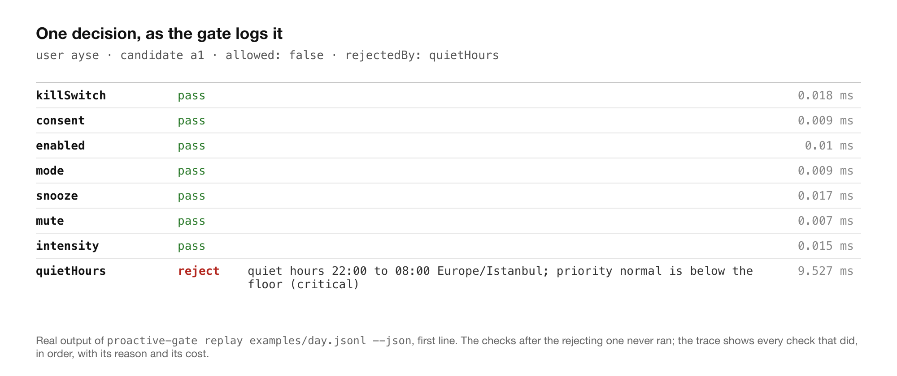

# proactive-gate

English | [Türkçe](README.tr.md)

<p>
  
  
  
  
  
  
</p>

Decide whether a proactive AI agent may reach a user right now, and log why not.

A proactive assistant has two halves. The generating half decides what is worth
saying. The suppressing half decides whether to say it now, later, or never. Almost
everything written about proactive AI is about the first half. This package is the
second half: one gate, an ordered list of checks, and a reason for every rejection.

```
npm install proactive-gate
```

```ts
import { createGate, defaultChecks, RedisStore } from "proactive-gate";

const gate = createGate({
  store: new RedisStore(redis),                  // MemoryStore() for one instance
  checks: defaultChecks({ dailyLimit: 3, quietHoursFloor: "high" }),
  onDecision: (d) => log.info("gate", d),        // every decision, allowed or not
});

const decision = await gate.evaluate({ user, candidate });
if (decision.allowed && (await gate.commit(decision, { user, candidate }))) {
  await send(decision.surfaces, candidate.payload);
}
```

Zero dependencies. TypeScript. Node 20 or newer. Framework-agnostic: the gate sits
between "the model produced something" and "the user's phone buzzed", whichever
model or framework produced it. Examples: [`examples/vercel-ai-sdk.ts`](examples/vercel-ai-sdk.ts),
[`examples/mastra.ts`](examples/mastra.ts), and a replayable policy in
[`examples/policy.js`](examples/policy.js).

## What a decision looks like

```ts
{
  allowed: false,
  userId: "ayse",
  candidateId: "a1",
  rejectedBy: "quietHours",
  reason: "quiet hours 22:00 to 08:00 Europe/Istanbul; priority normal is below the floor (high)",
  surfaces: [],
  trace: [
    { id: "killSwitch", outcome: "pass", ms: 0.02 },
    { id: "consent",    outcome: "pass", ms: 0.01 },
    { id: "enabled",    outcome: "pass", ms: 0.01 },
    { id: "mode",       outcome: "pass", ms: 0.01 },
    { id: "snooze",     outcome: "pass", ms: 0.02 },
    { id: "mute",       outcome: "pass", ms: 0.01 },
    { id: "intensity",  outcome: "pass", ms: 0.02 },
    { id: "quietHours", outcome: "reject", reason: "quiet hours 22:00 to 08:00 …", ms: 0.09 }
  ],
  evaluatedAt: 2026-09-04T03:00:00.000Z
}
```

<p align="center"></p>

With one gate and a logged reason, "why was the user not told about this" has an
answer. With checks scattered through a pipeline, the honest answer is "somewhere,
something returned false".

## The checks, in the order the default runs them

| # | check | rejects when | notes |
|---|---|---|---|
| 1 | `killSwitch(isOn)` | your flag is on | production hard-stop; silences every producer at once |
| 2 | `consent()` | `user.consent` is false | comes first, or you have evaluated preferences for someone who never agreed |
| 3 | `enabled()` | `user.proactiveEnabled === false` | per-profile switch |
| 4 | `mode({ allow })` | `user.mode` is not in the list | e.g. only `"normal"`, never `"focus"` |
| 5 | `snooze()` | `user.snoozedUntil` is in the future | global pause |
| 6 | `mute()` | `candidate.type` is in `user.mutedTypes` | per-type mute |
| 7 | `intensity()` | priority is below the user's intensity floor | low hears only high, normal hears normal and up, high hears everything |
| 8 | `quietHours({ priorityFloor })` | inside the user's local quiet window | IANA time zone, window may cross midnight, bypassed at or above the floor |
| 9 | `trustRamp({ days, minPriority })` | user is newer than `days` and priority is below the floor | the system is least calibrated exactly when the user is least forgiving |
| 10 | `dismissalCooldown({ dismissals, withinDays, silenceDays })` | the user dismissed that type `dismissals` times in the window | fed by `gate.record(user, candidate, "dismissed")`; every further dismissal restarts the silence |
| 11 | `adaptiveTiming({ nextGoodMoment, surfacesFor })` | never | non-rejecting: moves `deliverAt` or narrows surfaces; a check marked `nonRejecting` cannot reject even if it tries |
| 12 | `dailyBudget({ limit, bypassPriority })` | the user's local-day counter is at the limit | `evaluate` reads, `commit` increments atomically and can still refuse |

Order is a design decision and it should be visible. Consent has to come before
everything. Quiet hours have to come before the budget, or a rejected candidate
consumes a delivery it never made. Reorder freely; the trace will show what you did.

```ts
import { createGate, checks } from "proactive-gate";

const gate = createGate({
  checks: [
    checks.consent(),
    checks.quietHours({ priorityFloor: "high" }),
    checks.dailyBudget({ limit: 3, bypassPriority: "critical" }),
    myOwnCheck, // { id, run(ctx) => pass | reject | adjust | skip }
  ],
});
```

### Writing your own check

A check is an object with an `id` and a `run` function. It receives the user, the
candidate, the clock, the resolved priority, the store and the surfaces still on the
table, and returns `pass`, `reject` with a reason, `adjust`, or `skip`. It appears in the
trace like every built-in one.

```ts
const weekendFloor = {
  id: "weekendFloor",
  run: ({ now, priority }) => {
    const day = now.getUTCDay();
    if ((day === 0 || day === 6) && priority !== "high" && priority !== "critical") {
      return { kind: "reject", reason: "weekend: only high priority" };
    }
    return { kind: "pass" };
  },
};
const gate = createGate({ checks: [checks.consent(), weekendFloor, checks.dailyBudget({ limit: 5 })] });
```

Mark a check `nonRejecting: true` when it may only move timing or narrow surfaces; the
gate then ignores a reject from it and says so in the trace, so a bug in a timing model
cannot silence a user.

## The budget is enforced at commit, not at evaluate

Two instances can both evaluate a candidate for the same user, both see four of
five used, and both decide to send. The only race-safe place to enforce a cap is
the atomic increment right before sending:

```ts
const decision = await gate.evaluate(input);        // reads the counter
if (decision.allowed && await gate.commit(decision, input)) {   // INCR, returns false on the sixth
  await send(...);
}
```

`RedisStore` uses `INCR` and attaches the day's TTL on the first increment. The
counter is keyed on the user's local day, so a budget resets at the user's midnight,
not at UTC.

## Fail open, on purpose

When a store-backed check throws (Redis is down), the default lets the candidate
through and records `outcome: "skip", reason: "check threw (…); failing open"` in the
trace. A cache outage should not silence every user of a product whose whole point
is to speak up. If your product would rather stay silent, pass `onStoreError:
"closed"` and the same failure becomes a rejection that names the check.

## Replay a day before you ship a policy

The CLI takes a JSONL file of `{ user, candidate, now }` lines and reports what a
policy would have done. `--commit` consumes the budget in order, as production would.

```
npx proactive-gate replay examples/day.jsonl --commit
```

```
17 candidates  ·  7 allowed (41.2%)  ·  10 rejected

check        rejected  example
---------------------------------------------------------------
intensity           3  priority low is below the "normal" intensity floor (normal)
consent             3  user has not consented to proactive behaviour
mode                2  operating mode "focus" does not allow proactive messages
quietHours          1  quiet hours 22:00 to 08:00 Europe/Istanbul; priority normal is below the floor (critical)
dailyBudget         1  daily budget of 5 used (5)
```

`--policy examples/policy.js` loads your own gate; `--json` prints one full decision
per line for a notebook. Replay a week of real candidates against a proposed policy
and you know its allow rate and its silence reasons before a single user does.

## Learning from what happened

```ts
await gate.record(user, candidate, "dismissed");   // feeds dismissalCooldown
await gate.record(user, candidate, "acted");       // recorded for you to extend
await gate.inspect(user);                          // { budgetUsed, dismissals }
```

Silence has to be measurable or it becomes an excuse. Log every decision through
`onDecision`; the allow rate, the top rejection reasons, and the dismissal rate of
what was allowed are the three numbers that tell you whether the gate is tuned.

## What this does not do

- It does not decide what is worth saying. That is the generating half, and it
  belongs to your model and your product.
- It does not score value against attention. `adaptiveTiming` is a hook for your
  own model of the user's next good moment; the package ships no such model.
- It does not coordinate across products. If three agents each respect a budget of
  three, the user still gets nine. A cross-agent layer is a different problem.
- It does not replace consent law. `consent()` checks a boolean you set; how you
  obtained it is on you.

## Where it comes from

This is the delivery gate from [LILA](https://efe-genc-portfolio.vercel.app/projects/lila/),
a proactive assistant I have been building alone since February 2026, extracted and
made framework-agnostic. The order of the twelve checks, the trust ramp, the
three-in-thirty cooldown and the fail-open budget are all decisions that were made
in production and defended in
[The hardest part of a proactive assistant is knowing when not to speak](https://efe-genc-portfolio.vercel.app/writing/knowing-when-not-to-speak/).
Tian Pan's
[notification budget](https://tianpan.co/blog/2026-05-13-background-agents-notification-budget-attention-economy)
essay argues the same case from the product side and suggests a daily cap of three
to five; `defaultChecks({ dailyLimit })` defaults to five.

## Development

```
npm ci
npm test        # tsc build, then node:test over dist/test
```

MIT.
